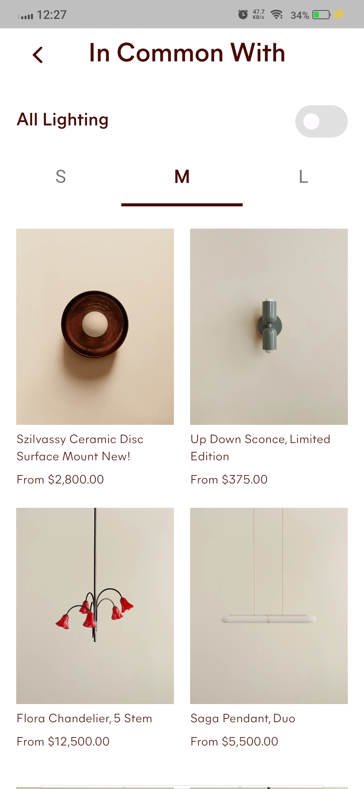
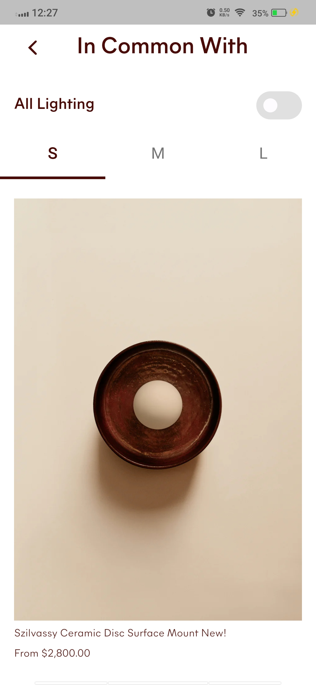
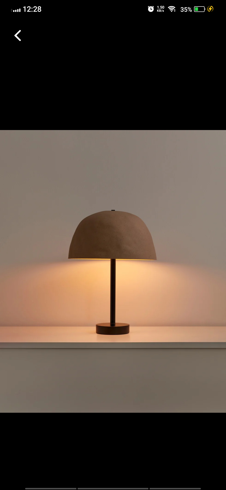

# Lamp Switcher - Interactive Lighting Gallery 💡

Welcome to **Lamp Switcher**! This is a beautiful Flutter application that showcases an interactive gallery of lamps with smooth animations and intuitive controls. Explore different lighting options with an elegant UI that allows you to toggle between on and off states with satisfying animations.

---

## 📱 **App Overview**

Lamp Switcher is an interactive lighting gallery app where users can browse through various lamp designs and toggle them on/off with smooth animations. The app features a responsive grid layout, size filtering options, and detailed views of each lamp. Built with Flutter, it provides a seamless experience across platforms with beautiful transitions and thoughtful interactions.

---

## 📦 **Download**

download the APK directly:
- [Lamp Switcher.apk](./app-release.apk)

---

## 📸 **Screenshots**

<table>
  <tr>
    <td></td>
    <td></td>
    <td></td>
  </tr>
  <tr>
    <td></td>
    <td></td>
    <td></td>
  </tr>
</table>

## 🎞️ Video

[Watch the video](https://github.com/user-attachments/assets/a6e1efb5-7952-43f7-9d42-67338fe51c3c)

---

## ⚙️ **Technologies Used**

This project is built with **Flutter** and utilizes modern development practices:

### UI & Design:
- **Flutter Widgets** - Rich set of pre-designed widgets
- **Custom Components** - Custom switcher, app bar, and tabs
- **Hero Animations** - Smooth transitions between screens
- **InteractiveViewer** - Zoom and pan functionality for images
- **Material Design** - Clean, modern interface following Material guidelines

### Architecture & State Management:
- **StatefulWidget** - Component state management
- **AnimationController** - Smooth animations and transitions
- **Repository Pattern** - Data management and organization

---

## 🚀 **App Features**

- 💡 Interactive lamp gallery with on/off toggle functionality
- 🎨 Smooth animations when switching between lamp states
- 📱 Responsive grid layout that adapts to different screen sizes
- 📏 Size filtering options (S, M, L) to adjust grid density
- 🔍 Detailed view of each lamp with zoom capabilities
- 🎯 Intuitive controls with custom-designed components
- 📊 Price information and product details for each lamp
- 🌙 Beautiful color scheme with thoughtful contrast

---

## 🎮 **How to Use**

1. **Browse** through the collection of lamps in the grid view
2. **Toggle** all lamps on/off using the switch at the top
3. **Adjust** the grid size using the size tabs (S, M, L)
4. **Tap** on any lamp to view it in detail with zoom capabilities
5. **Explore** the lamp details including name and price information

---

## 🔧 **Technical Specifications**

- **Platform:** Flutter (Cross-platform)
- **Language:** Dart
- **Architecture:** Widget-based with State Management
- **Animation:** Flutter AnimationController
- **UI Components:** Custom widgets and Material Design

---

## 📄 **License**

This project is licensed under the MIT License - see the [LICENSE](LICENSE) file for details.

---

## 📞 **Contact & Support**

For any questions, suggestions, or support, feel free to reach out:

- 📧 **Email:** developer@example.com
- 🌐 **GitHub:** [Lamp Switcher Repository](https://github.com/username/lamp-switcher)

---

## 🙏 **Acknowledgments**

- Flutter development team for the amazing framework
- Material Design guidelines by Google
- The Flutter community for continuous support and inspiration

---

**Developed with ❤️ using Flutter**

---

## 📚 **What Developers Can Learn From This Code**

This project serves as an excellent learning resource for Flutter developers:

- **Animation Techniques**: Learn how to implement smooth transitions between different states
- **Custom Widget Development**: See how to build reusable components like custom switchers and app bars
- **Hero Animations**: Understand how to create seamless transitions between screens
- **State Management**: Explore effective ways to manage UI state in Flutter applications
- **Responsive Design**: Learn how to create layouts that adapt to different screen sizes
- **Image Handling**: See how to work with images, including error handling and interactive viewing

Whether you're a beginner looking to understand Flutter basics or an experienced developer seeking animation inspiration, this codebase offers valuable insights into modern Flutter development practices.

